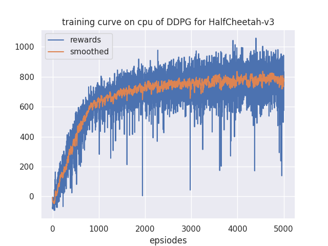
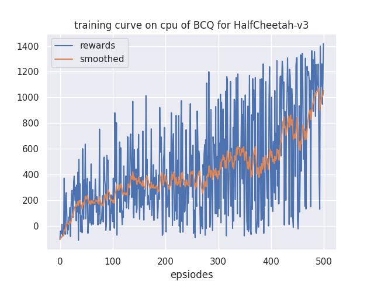
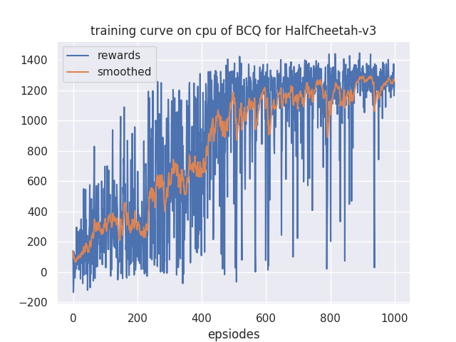

# VAE介绍

[一文理解变分自编码器（VAE）](https://zhuanlan.zhihu.com/p/64485020)
[VAE手写体识别项目实现（详细注释）从小项目通俗理解变分自编码器（Variational Autoencoder, VAE）tu](https://blog.csdn.net/weixin_40015791/article/details/89735233)

# BCQ算法介绍
1. [BCQ 张楚珩](https://zhuanlan.zhihu.com/p/136844574)
2. [（RL）BCQ](https://zhuanlan.zhihu.com/p/206489894)
3. [BCQ github code](https://github.com/sfujim/BCQ/tree/master/continuous_BCQ)
4. [Batch RL与BCQ算法](https://zhuanlan.zhihu.com/p/269475418)

# BCQ 训练过程
BCQ算法属于offline RL，因此需要 行为智能体来收集数据， 然后根据数据进行学习，而不与环境进行交互。 
算法执行步骤：
1. **生成行为智能题模型**：使用 DDPG算法 （可以自行更换其他算法） 与环境交互，模型学习好之后将模型保存。 
2. **获取训练数据**： 主目录的config下开启 "collect" mode，采用“BCQ算法”， 将DDPG算法的model复制到 “BCQ/behaviour_models”下， 
然后在 "tasks/你的训练文档/traj"下会生成memories对应的数据。
3. **训练BCQ agent**： 主目录下的config开启 "train" mode,采用“BCQ”算法，将上一步骤生成的"traj"复制到"BCQ/traj"下， 
然后训练就可以结果。 **注意**：因为训练过程中不与环境交互，因此每次训练完智能体，我们都会test_one_episode，生成reward。

# 重要参数

BCQ/config.py

## 神经网络参数：

self.critic_hidden_dims = [400,300] # 请写成 列表形式

self.actor_hidden_dims = [400,300]

self.vae_hidden_dims = [750,750] # need to modified

## 学习参数：

self.critic_lr = 1e-3

self.actor_lr = 1e-3

self.vae_lr = 1e-3

self.batch_size = 128

self.gamma = 0.99

self.tau = 0.005

self.lmbda = 0.75 # soft double Q learning 

self.phi = 0.05 # BCQ 特有的参数， 表示 action 相比存在的action， 最大的变化范围

## 训练参数： 训练数据 默认在 BCQ/traj/traj.pkl中

self.iters_per_ep = 10  # train_one_episode中 每次学习的次数

self.buffer_size = int(1e5) # memories的大小

self.start_learn_buffer_size = 1e3 # 训练时最少的经验数目 

## 收集数据的参数：

self.collect_explore_data = True # 收集数据时 DDPG是否加噪音

self.behavior_agent_name = "DDPG" # 使用的行为智能体算法

self.behavior_agent_parameters_path = "/behave_param.yaml"  # 行为智能体的参数， 在BCQ目录下

self.behavior_policy_path = "/behaviour_models"  #  行为智能体的模型， 收集数据时需要用到

self.collect_eps = 500 # 收集的数据 episode 数量

# 结果
1. 我使用了 HalfCheetah-v3  max_timesteps=200 "cpu" 来验证了算法。

2. DDPG本身的训练在 /BCQ/tutorial_dat/Train DDPG 20230411 中，结果如下图：

3. 使用DDPG 生成了 500episode 没有噪音（imitation traj） 和 有OU噪音 (traj_with_exploration) 的数据，然后分别进行了训练。

imitation learning的结果：

带有OU噪音的结果：

4. 我们可以看到 Imitation learning对应的结果还没有收敛，因此我们将训练增加到了1000 episodes(其他参数不变)，然后结果如下：
 

我们可以看到 imitation learning 结果 > with OU exploration 结果

